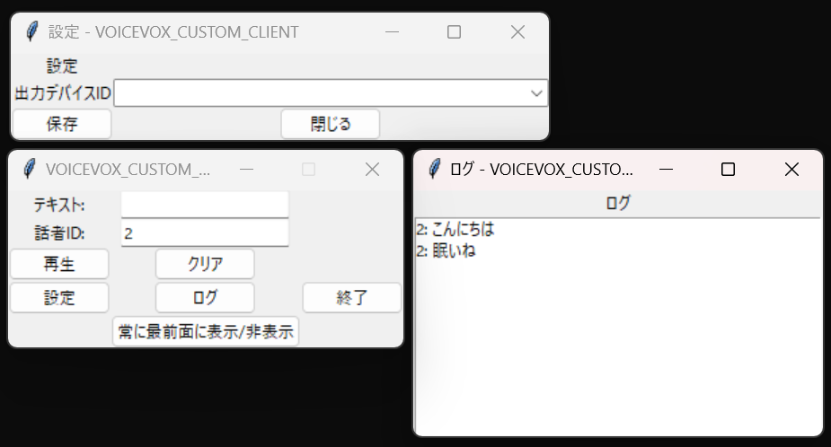

# VOICEVOX_Client
VOICEVOX Python Client



## 重要
このプログラムはメンテナンスされなくなりました。

## これはなに
VOICEVOXを必要最小限で扱うためのクライアントです。

ボイスチャットなどでしゃべれないから代わりに読み上げてもらおうってことで作りました。

(DiscordBOTを作ったのでこのプログラムは不要になりました。BOTは後日公開予定です。)

自分用に作ったので、欲しい機能をとりあえず実装して動けばいいや精神です。

再生にかかる時間はVOICEVOXの音声生成速度に依存します。GPU使いましょう(体感そんなに変わらないので微妙)

ただし、公式のVOICEVOXエディタ(?)が圧倒的に早いです。(致命的)

なんの差なんだ？

## 初期セットアップ
[VOICEVOX](https://voicevox.hiroshiba.jp/)をインストールし、初期セットアップを行っておいてください。

Windowsのコマンドプロンプトを想定しています。

(Linuxなどは適宜コマンドを置き換えてください。)

仮想環境の構築
```
python -m venv venv
.\venv\Script\activate
```

ライブラリのインストール

```
pip install requests pyaudio
```

これでOKです。

## 使い方
最初に[VOICEVOX](https://voicevox.hiroshiba.jp/)を起動します。

シンプルなので起動すればいけると思います。

仮想環境に入っている状態で以下のコマンドで実行できます。

```
python main.py
```

## 表示
[VOICEVOX](https://voicevox.hiroshiba.jp/)を使用しています。

公式の利用規約に基づいて利用してください。
